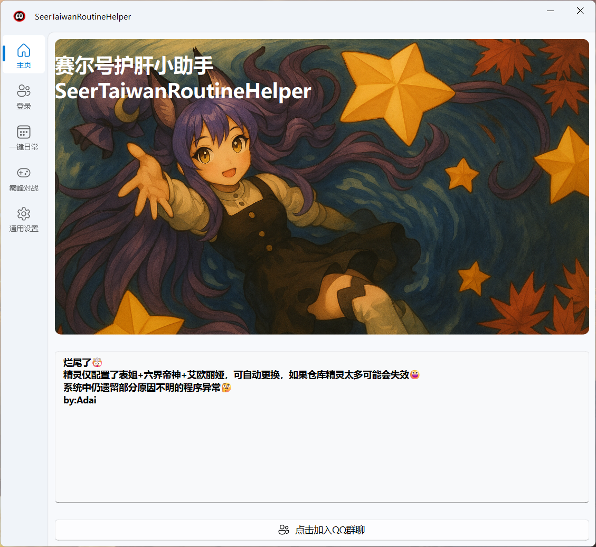
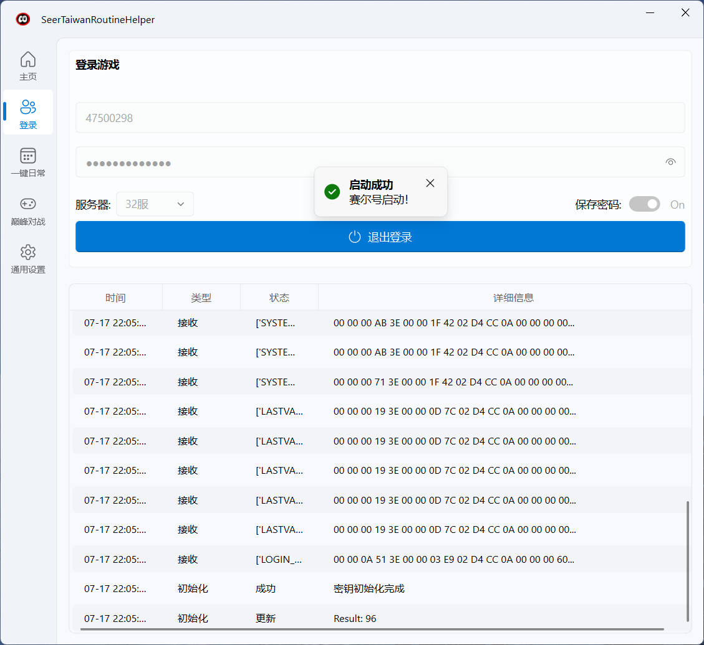
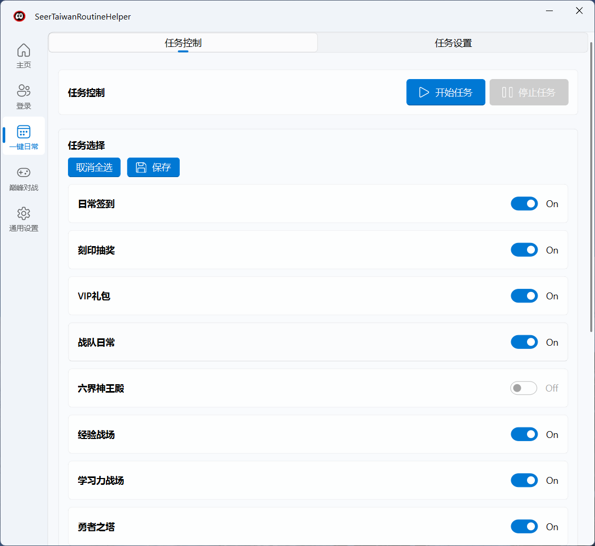
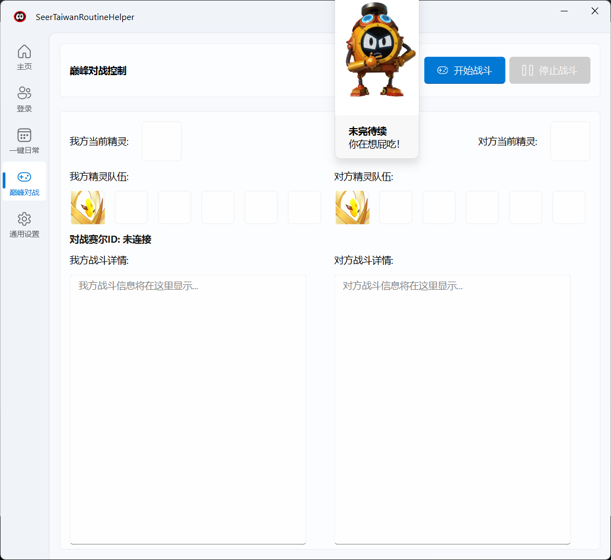
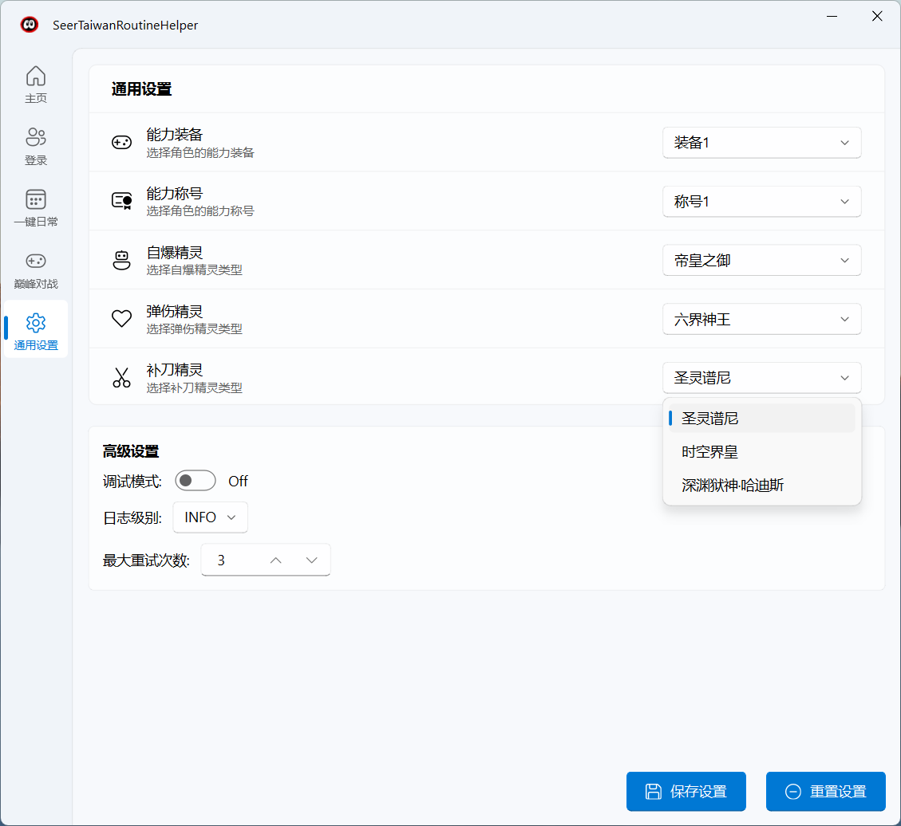

<div align="center">

# 赛尔号台服护肝小助手


一个基于 **PySide6-Fluent-Widgets** 的现代化赛尔号台服护肝小助手
采用 **Fluent Design** 设计语言，提供优雅的用户界面和强大的自动化功能

</div>

> [!WARNING]
> 本项目为开发版本，部分功能可能存在缺失或不稳定的情况。六界神王殿和巅峰对战功能暂未实现，部分日常任务可能因游戏更新而失效，使用过程中如遇到问题，请及时反馈。

---

## ✨ 核心特性

### 🏠 **智能登录系统**
- 🔐 **安全登录**：支持用户ID和密码登录，可选择保存密码
- 📊 **实时监控**：表格形式显示游戏连接状态和操作日志
- 📱 **现代界面**：采用卡片式设计，支持亮色主题

### 📅 **一键日常任务**
支持 **13种** 常见日常任务的智能化执行：

| 任务类型 | 功能描述 | 状态 |
|---------|---------|------|
| 🎁 刻印抽奖 | 自动参与每日刻印抽奖活动 | ✅ |
| 💎 VIP礼包 | 自动领取VIP专属礼包 | ✅ |
| 🏆 战队日常 | 完成战队贡献任务 | ✅ |
| 🏛️ 六界神王殿 | 挑战六界神王殿副本 | 🚧 |
| ⚡ 经验战场 | 自动挑战经验训练场 | ✅ |
| 📚 学习力战场 | 自动挑战学习力训练场 | ✅ |
| 🗼 勇者之塔 | 自动挑战勇者之塔关卡 | ✅ |
| ⛏️ 泰坦矿洞 | 自动挖掘泰坦矿洞资源 | ✅ |
| 🌊 泰坦源脉 | 自动探索泰坦源脉 | 🚧 |
| 👑 精灵王试炼 | 自动参与精灵王试炼 | ✅ |
| 🔒 X战队密室 | 自动挑战X战队密室 | ✅ |
| ⭐ 星愿漂流瓶 | 自动许愿星愿漂流瓶 | ✅ |
| 📋 日常签到 | 自动完成每日签到 | ✅ |

## 🏗️ 项目结构

```
SeerTaiwanRoutineHelper/
├── main.py                 # 主入口文件
├── config.ini             # 配置文件
├── core/                   # 核心模块
│   ├── client.py          # WebSocket客户端
│   ├── ui_login.py        # 登录功能包装
│   ├── main.py            # 核心主程序
│   ├── Login.py           # 登录处理
│   ├── SendPacketProcessing.py   # 发包处理
│   ├── ReceivePacketAnalysis.py  # 收包分析
│   └── PetFightPacketManager.py  # 战斗包管理
├── view/                   # 视图界面模块
│   ├── main_windows.py    # 主窗口
│   ├── home_interface.py  # 主页界面
│   ├── daily_interface.py # 一键日常界面
│   ├── fight_interface.py # 巅峰对战界面
│   ├── login_interface.py # 登录界面
│   └── settings_interface.py # 通用设置界面
├── component/             # 组件模块
│   └── PetView.py         # 精灵显示组件
├── function/              # 功能模块
│   ├── Algorithms.py      # 算法处理
│   └── Command.json       # 命令配置
└── resource/              # 资源文件
    └── image/             # 图片资源
```

## 🚀 快速开始

### 📋 **系统要求**

| 项目 | 要求 | 推荐 |
|------|------|------|
| 🖥️ **操作系统** | Windows 10+ | Windows 11 |
| 🐍 **Python版本** | Python 3.8+ | Python 3.11+ |
| 💾 **内存** | 4GB+ | 8GB+ |
| 💿 **存储空间** | 100MB+ | 500MB+ |

### 📦 **安装依赖**
```bash
pip install -r requirements.txt
```

### 🎮 **运行程序**
```bash
python main.py
```

## 🖼️ 界面预览


*主界面 - 登录和实时监控*


*登录界面 - 用户认证*


*一键日常 - 任务选择和执行*


*巅峰对战 - 自动战斗控制*


*设置中心 - 参数配置*

## 📄 许可证
本项目采用 [MIT License](LICENSE) 开源许可证

## 🙏 特别鸣谢
感谢以下开源项目为本项目提供的技术支持和灵感：

- [SeerPacket](https://github.com/iyzyi/SeerPacket) - 提供了赛尔号网络协议分析的重要参考
- [seerNew](https://github.com/Altriazyk/seerNew) - 为项目开发提供了宝贵的技术思路

---

<div align="center">

### 🌟 希望对你有帮助⭐

**Made with ❤️ by Adai**


</div>
